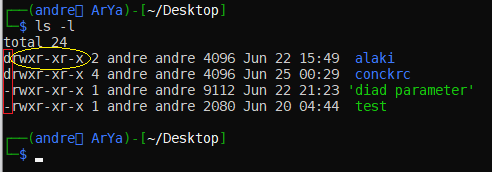

# chmod

خب همونجور که تو درس قبلی گقتیم که بعدا در مورد سطح دسترسی execute حرف میزنیم، امروز میخوایم در مورد این موارد حرف بزنیم

در دل لینوکس چه میگذرد؟ تا حالا فایلی رو دیدین که بهتون بگه شما اجازه ی تغیر یا پاک کردنشو ندارین؟ یا مثلا یه اسکریپنی از یه جایی برداشته باشی ولی نتونی اجراش کنی؟ و چیزایی از این قبیل...

خب توی لینوکس ما یک یوزر \(یک یا چند\) داریم یک گروه \(یک یا چند\) داریم و چیزی تحت عنوان آدرز \(others\) خب ما دقیقا برای هرکدوم از این سه گروه میتونیم مشخص کنیم که در مواجهه با فایل ما چقدر دسترسی دارن! مثلا من یوزر فلان هستم و این فایلو خودم ایجاد کردم دلم میخواد هم دسترسی نوشتن هم خواندن و هم اجرا کردن داشته باشم. همچنین منه کاربر فلان عضو گروه بهمان هستم که شما ام کاربر همین گروهی مثلا خب من به شما اطمینان دارم و میخوام شما محتوی فایل منو ببینی و بتونی اجراش کنی ولی دیگه تغیرش نتونی بدی. از طرفی من نمیدونم این فایلی که نوشتم باگ داره یا نه پس به هرکس دیگه ای که تو این سیستمه ولی من نیست یا تو گروه من نیست میخام نه دسترسی write و نه دسترسی execute نداشته باشه فقط وفقط بتونه فایلمو نگا کنه \(هرچند که میتونیم حتی اجازه ندیم که نگا کنه :\) \)

خب حالا این دسترسی هارو از کجا باید ببینیم؟ برو به مسیری که میخوای سطح دسترسی یه فایلی رو ببینی و بعدش اونجا بزن ls -l

خب چپ ترین چیزی که توی هر خط میبینین یه همچین چیزیه 👇👇

خب ستون اول که دورش مستطیل قرمز کشیدم نشون میده که این فایله یا دایرکتوری که خب اگه این رکورد\(حرف\) d بود ینی directory عه اگه خط تیره " - " بود ینی فایله اگر L بود ینی لینکه \(\( بعدا ممکنه درموردش حرف بزنیم- یه مدل فایل در نظرش بگیرین که به یه فایل دیگه داره اشاره میکنه \)\) رکوردای دیگم مثل b و c و یا حتی چیزای دیگه ک من حداقل تا امروز ندیدم هم داریم که اگه اومدم سراغش مفصل در موردشون حرف میزنیم

خب ولی اون ردیفی که دورش بیضی زرد کشیدم رو ما امروز باهاش کار داریم. سه تای اول مربوط به همین یوزر خودمونه وطبق شکل میبینیم که نوشته rwx ینی یوزر ما دسترسی خواندن نوشتن و اجرای فایل رو داره؛ سه تای دوم مال گروهه که نوشته r-x ینی کسایی که یوزر ما نیستن ولی عضو گروهن دسترسی خواندن و اجرا کردن دارن؛ و سه تای آخر هم مال others یا به اصطلاح بقیه ی کاربرای سیستم که تو گروه ما نیستن عه که میبیننی نوشته x-- ینی فقط میتونن اجراش کنن.

خب حالا ما چطوری میتونیم این دسترسیا رو عوض کنیم؟ با کامند chmod که باید با سطح دسترسی روت اجراش کنین البته sudo chmod

| معادل باینری | نحوه نمایش هنگام ls -l | سطوح دسترسی |
| :---: | :---: | :---: |
| 0 | - - - | هیچ غلطی نمیتونه بکنه |
| 1 | - - x | فقط دسترسی اجرا داره |
| 2 | - w - | فقط دسترسی نوشتن داره |
| 3 | - w x | دسترسی نوشتن و اجرا کردن |
| 4 | r - - | فقط دسترسی خواندن داره |
| 5 | r - x | دسترسی خواندن و اجرا کزدن |
| 6 | r w - | دسترسی خواندن و نوشتن |
| 7 | r w x | هر غلطی بخواد میتونه بکنه |

خب کافیه یادتو باشه r = 4 و w = 2 و x = 1 و هیچی مساوی 0

حالا خواستی دسترسی اجرا و خواندن بدی میشه : 1+4

خواستی دسترسی خواندن و نوشتن بدی میشه : 2+4

و بقیشم از همین الگو پیروی میکنن. خب بریم دسترسی این فایل test که تو تصویر قبلی هم بودا عوض کنیم👇👇

خب اگه خواستی یه دسترسی خواص به همه بدی با به علاوه میتونی و اگه خواستی دسترسی خواصی رو از همه بگیری با منهی میتونی مثال👇👇

نکته: یادتون باشه اگه پشت اون عدد سه رقمی منهی بزنین دسترسی هایی که تعین کردین رو میگیره \( مثلا 124- به ترتیب دسترسی های اجرا نوشتن و خواندن رو از یوزر گروه و بقیه میگیره\)

اگر هم پشتش مثبت بزارین ینی این دسترسی هایی ک تعین کردین رو اضافه کنه یه دسترسی های موجود

اگر علامت نزارین واسش کلا دسترسی هارو اینجور که گفتین میکنه \(پرمیشن هایی که از قبل داشته رو فراموش میکنه\)

نکته دو: دیفالت سطح پرمیشن رو میتونین توی سیستمون با دستور umask تغیر بدین که توصیه نمیکنم\( umask خالی بنویسی دیفالت حال حاضر سیستمت رو نشون میده خواستی تغیر بدی 777 رو منهی پرمیشنی که میخوای دیفالت سیستمت باشه کن\) \(\( مثلا umask 022 ینی هرفایل جدیدی که ایجاد شد بهش پرمیشن 755 بده\)\)

نکته سه: به هرفایلی دسترسی اجرا واسه others ندین چون ممکنه فایل بدی باشه و ...

نکته چهار: پرمیشن معمولی که ما عمدتا میدیم 755 یا 744 عه ولی خب وابسطه به نیازه دیگه :\)\)

نکته پنج: برای دیدن اطلاعات فایل همچون پرمیشن ایناش جای ls -l میتونی از کامند stat استفاده کنی میخوای مرور کنی ایناهاش👇👇



نکته شش: فکر نکن این کامند بدر نخوره فعلا یادش بگیر بعدنا کارت بهش میوفته مخصوصا موقع شل اسکریپت نویسی\( یا اونجا که گفتم کامند شخصی خودمونو بنویسیم\)

نکته هفت: برو تو مسیر bin/ گفتیم اینجا فایلای باینری هستن؛ یه ls -l بزن میبینی همه اینا چوم فایل اجرایی ان دسترسی x یا همون execute دارن \(\(خر دسترسی هاشونو ازشون نگیریا\)\) \(\(کلا با این مدل دایرکتوریا سعی کن شوخی نکنی :\) \)\)

دیگه چیز دیگه ای به ذهنم نمیاد جز اینکه بگم برو منوالش رو بخون و همین دیگه \(سعی کردم کامل باشه ولی خب یه سری چیزارو نگفتم چون از باب مطلب دور میشد\) شاد و پیروز باشید :\)\)

