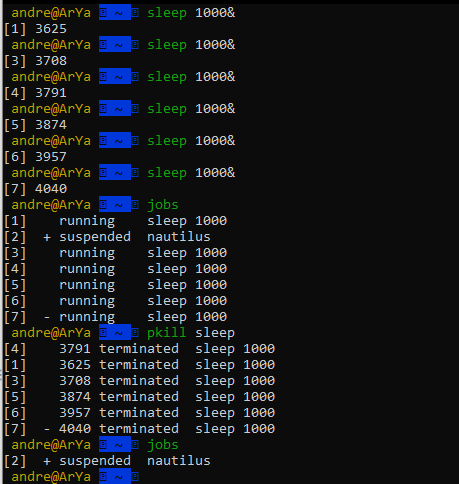

# kill

بعضی وقتا هست که ما میخوایم یک برنامه رو زوری ببندیم!! (حالا شاید زوری هم نه ولی میخوایم پروسه‌ی اجراش تموم شه بره دیگه :))


[some-of-terminal-shortcuts.md](some-of-terminal-shortcuts.md)


اگر سومین مورد رو توی این درس 👆👆 امتحلن کرده باشین (و الانم امتحانش کنین باز) میبیینین که واستون نوشته مثلا

\[1] + 653 suspended xeyes

خب اون یک که ینی چندمین پروسه است مثلا اگه یه بار دیگه این کارو بکنین اون عدد داخل کروشه میشه دو

اون عددی هم که بعد به‌اضافه نوشته PID برنامس که میتونین با pa -aux چکش کنین

خب در مورد ساسپمد هم که واضحه و آخری ام اسم برنامه ای هست که در حال اچرا بوده و کنترل زد زدیم

اگر چنتبار چنتا پروسه ی مختلف رو استاپ کردین و خواستین لیست همشون رو ببینین توی ترمینالتون بنویسن jobs خروجی این شکلیه👇👇

خب این مثبت و منفی ها چیه اگه الان توی ترمینالتون بنویسین fg یا bg ((مخفف فورگراند و بکگراند)) اون پروسه ای که مثبت داره شروع میکنه به ادامه دادن بک گراند ینی پروسه اجرا میشه ولی دیگه ترمینالت رو درگیره خودش نمیکنه مثلا اگه بزنی sleep 100 تا مادامی که کار sleep تموم نشه نمیتونی از این ترمینالت استفاده کنی ولی اگه تو بک گراندت اجرا بشه فلواقع پروسه داره اجرا میشه ولی تو بک گرانده و از ترمینالتم استفاده میکنی اگه خواستی مثلا سومی اجراش ادامه پیدا کنه بنویس fg %3 یا bg %3 که شما الان دیگه تفاوت bg و fg رو میدونین و اگه نمیدونین سرچ کنین دیگه :))

خب حالا بیایم سر درس امروزمون آقا کامند kill که اصلا میزان خشنیتش (( خشن بودنش)) از اسمشم پیداست. خب خیلی راحت بنویس kill %1

حالا یه بار دیگه بنویس jobs . خب میبینی که شماره یکه کشته شده و دیگه نیس :))

حالا مثلا اگه ده تا پروسه استاپ شده داشتی مثلا هشتمی رو با kill %8 میکشیمش =))

خب آیا فقط پروسه های استاپ شده رو میتونیم کیل کنیم؟؟! خب منطقا نه یه ps -aux بزن وPID برنامه ای که میخوای بکشیش رو جلوی kill بنویس مثلا من میحوام پروسه با PID 653 رو کیل کنم مینویسم kill 653 که خروجیش برابر اینه

\[1] 653 terminated xeyes

حالا اصلا هر برنامه ای میخوای گرافیکی باز کن و با "اسم برنامه" ps -aux | grep بعد از اینکه PID اش رو یافتی کیلش کن :))

خب جدا از اینکه منوالش رو بخونین و با آپشناش آشنا بشین (البته اگر دوست داشتین) یه سری آپشن عددی هم داره که لیستشو این پایین میزارم براتون

خب همین دیگه شما الان میدونین کیل چیه و به چه درد میخوره فقط تا نرفتین بگم اسم خواهرش pkill عه که کافیه جلوش اسم برنامه ای که میخوای کیل شه رو بنویسی بعد هرچنتا پروسه با ائن برنامه باشه رو میکشه مثالش ایناها

و داداششم xkill عه که وقتی توی ترمینال بنویسیش نشانگر موست (cursor pointer) شکل یه ضربدر میشه حالا روی هر برنامه که موستو ببری و روش کلیک کنی میبندتش :))

از اونجایی ام که این داداشمون خیلی پر استفادس شورتکاتم داره که شورتکاتش عموما Ctrl + Alt + Esc عه

فقط یه نکته حواست باشه صفحه دسکتاپتو کیل نکنی خواستی بکنی ام بکن ولی خب دسکتاپت میپره و باید یه بار خاموش روشن کنی ((اصلا امتحانی ام که شده یه بار کنترل آلت اسکیپ بزن و زارت بزن رو صفحه دسکتاپت ببین چی میشه 😂😂)) بعدش منترل آلت تی بزن ترمینالت مه اومد توش بنویس poweroff تا سیستمت خاموش شه یا بنویس reboot تا سیستمت ری استارت شه

خب دیگه خیلی طولانی شد ولی خیلی چیز یادگرفتینا بقیشم سرچ کنین :)) خسته نباشید

