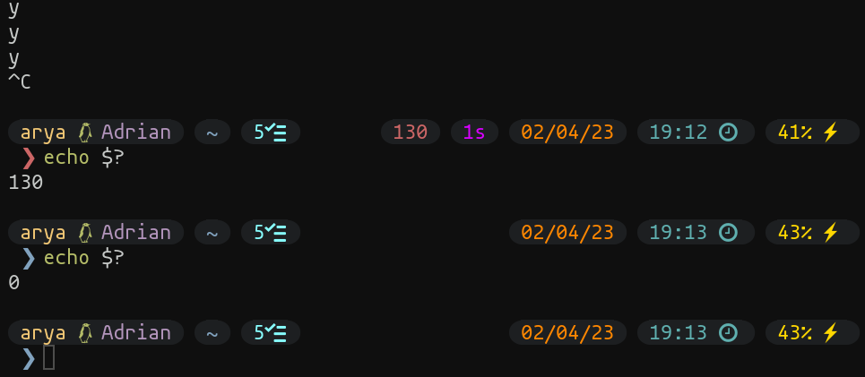

# ls -1

آپشن 1- برای این منظور استفاده می‌شود که خروجی کامند ls را به صورت ستونی و در هر ستون تنها یک فیلد، نشان دهد. مزیت استفاده از این آپشن اینه که میگن چشم انسان چیزای فقط سطری یا فقط ستونی رو سریع‌تر و بهتر میتونه بخونه؛ برای همین اگه شما از یه دایرکتوری با کلی محتوا (فایل و پوشه) ls بگیرین خروجیش یکم سخت دیده میشه و اگه از `ls -1` استفاده کنین کارتون راحت میشه.

<figure><figcaption>
مقایسه ls و ls -1 
</figcaption></figure>

نکته: ls -1 تقریبا شبیه به ls -l هستش... برای همین من خودم عمدتا از ls -l یا همون ll که قبل‌تر هم بهش اشاره کردیم استفاده می‌کنم.
