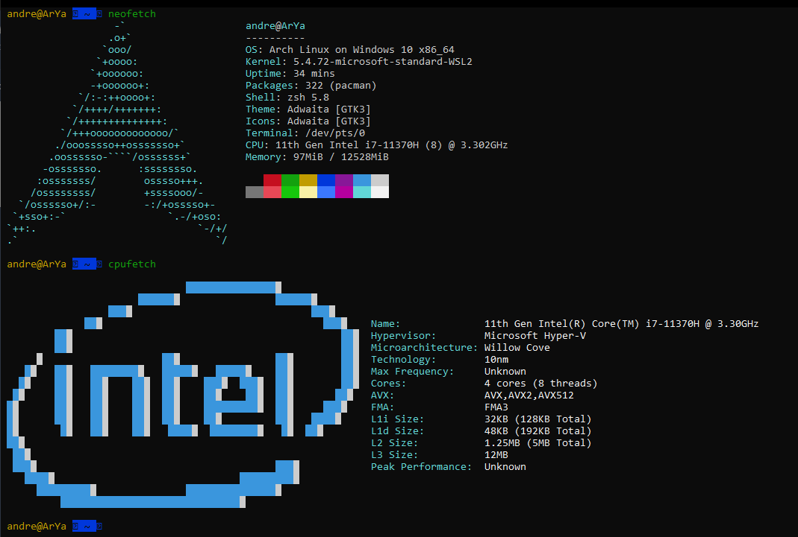

# neofetch & cpufetch & linuxlogo

اول از همه توسط پکیج منیچرت نصبش کن (تگه رو اوبونتو یا دبین بیسی بنویس sudo apt install neofetch)  ((screenfetch هم مثل همینه ولی من خودم از neofetch استفاده میکنم))

بعد تو ترمینالت بزن neofetch؛ به همین سادگی

یه دستور دیگم که اطلاعات سی پی یو سیستمتو نشون میده دستور cpufetch عه (اگر روی اوبونتو یا دبین بیسی با اسنپ میتونی نصبش کنی مطابق sudo snap install cpufetch )

اپشن هایی ام دارن مثلا من خودم واسه neofetch از آپشن ascii_distro-- استفاده میکنم که گداری جنبه فان داره😅😅

خب این linuxlogo که وابسطه به توزیعتون باید نصبش کنین (توی مخازن APT هست و روش نصب هم که <a href="apt-apt-get-aptitude.md">اینجا </a>گفته بودیم)

تنها نکتش اینکه از دیستروهای کم ولی حقی لوگو نشون میده و اگه خواستین لوگوی بقیه دیستروهارو نشون بدین به جای ascii_distro-- توی این کامند باید آپشن L- استفاده کنین که بعد از L- باید اسم توزیع مورد نظرتون رو بنویسین مثال 👇👇

 (1).png>)
