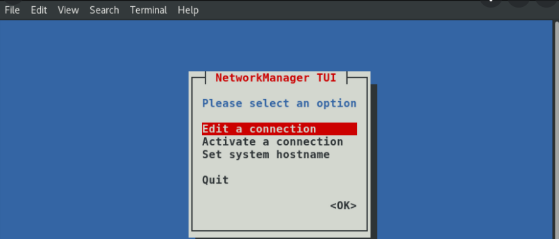
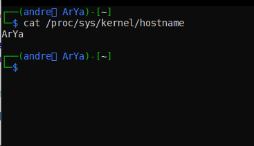

# nmtui

خب ما لینوکس یوزرا یکم زیادی وابسطه به ترمینالیم؛ اصلا شاید بشه گفت نیمی از قدرت لینوکس به منظور ترمینالیه که داره (بگذریم...)

خب امروز میخوایم نتورکمون رو کنترل کنیم توسط nmtui. کار خاصی نمیخواد بکنین فقط توی ترمینال بنویسینش بعدش یه دایالوگ این مدلی براتون باز میشه

خب گزینه اول که کانکشنایی که قبلا برقرار کردین اگه سیستمتون جوری تنظیم شده باشه که اطلاعات رو نگه داره اینجا هستن و شما میتونین تغیرشونم بدین ( مثلا اگه به یه شبکه وصل شدین و رمز اتصال یادتون رفته بود (( احتمالا )) اینجا پسوردو میبینین =) )

خب گزینه دوم و سومم که مشخصه از اسمش که چیه (هاست نیم همونه که اول پرامپتتون نوشته و از اسم یوزرتون با یه @ جدا شده)👇👇

مثل همیشه بیشتر خواستین بدونین سرچ کنین :))

