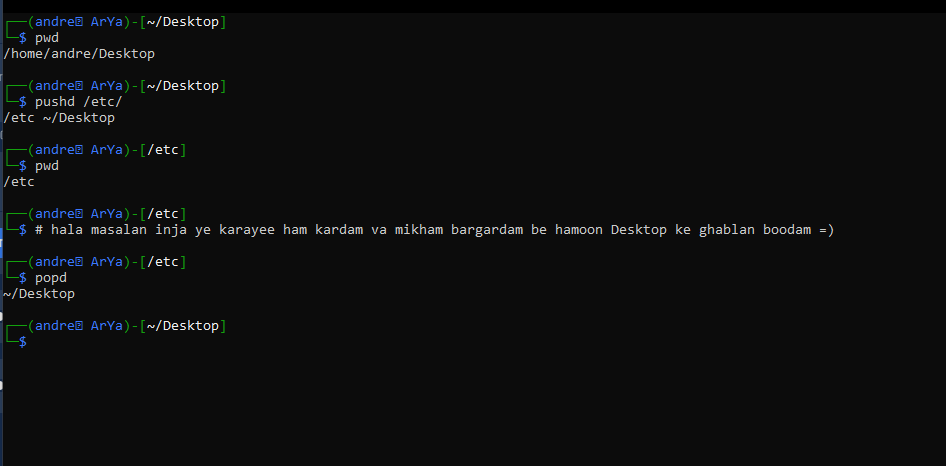

# pushd & popd

خب خیلی مختصر و مفید وقتی میخوای از یه دایکرتوری بری به یه دایرکتوری دیگه و بعدا برگردی به دایرکتوری قبلیت به جای این که یه بار pwd بزنی بعدش cd new_<em>deirectory</em>_path و بعد از اتمام کار دوباره cd کنی به مسیر قبلی کافیه به جای cd از pushd استفاده کنی که خودش توی یه استک(stack) ذخیره میکنه که کجا بوده و سپس path رو به ادرس جدیدی که جلوی پوش دی نوشتی میبره.

برای این هم که برگردی به جایی که قبلا بودی کافیه تو ترمینال بزنی popd همین =))

یه مثال ببینیم

خب اون اول pwd زدم که مشخص باشه کجاییم وگرنه اصلا نیازی به این کارم نیست دیگه :))

اگر بیشتر دوست داشتین در مورد این دوتا کامند بدونین منوالش (man page) رو بخونین :))

