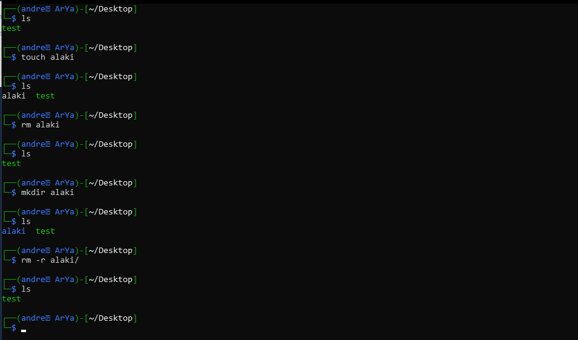

# rm

سلام :\)

قبل تر یادگرفتیم که چه شکلی یه دایرکتوری بسازیم و پاکش کنیم اگه یادتون نیس یه نگاهی بهشون بندازین تا یادتون بیاد [👇](https://emojikeyboard.org/copy/Backhand_Index_Pointing_Down_Emoji_%F0%9F%91%87?utm_source=extlink) [👇](https://emojikeyboard.org/copy/Backhand_Index_Pointing_Down_Emoji_%F0%9F%91%87?utm_source=extlink)



خب حالا این اخیرا هم که یادگرفتیم چه شکلی یه فایل بسازیم \(یکی که نه هر چنتا که دلمون بخواد البته😂😂\)

خب حالا میخوایم ببینیم این فایل ها چطوری پاک میشن\(\( این کامند برای پاک کردن هرچیزی اعم از فایل ها و دایرکتور ها مورد استفادس\)\)

خب اول از همه برای اینکه یادتونم باشه یه فایل با اسم alaki بسازین بعد لاهاش هرکاری ام خواستین بکنین :\) حالا توی ترمینال و توی مسیری که فایل alaki تون هست بنویسین rm alaki \(خب مصلما اگه یه فایل با یه اسم دیگه خواستین پتک کنین جای alaki اسم فایله رو میزارین دیگه\)

تبریک میگم فایلتون پاک شد. خب حالا یه دایرکتوری بسازین و سعی کنین با rm پاکش کنین :\) 

قاعدتا فحشتون داد و گفت نمیتونم دایرکتوری رو پاک کنم یا چیزی از این دست😂😂

خب آپشنای rm رو که بخونین آپشن r- یا R- که مخفف ریکرسیو هم هست کلا مال پاک کردن یه دایرکتوریه حالا فرقی ام نداره دایرکتوری پر باشه یا خالی :\)

پس برای پاک کردن دایرکتوری ها به جای rmdir directory-name میتونین از rm -r directory-name استفاده کنین

خب و اما کلام آخر بعضی وقتا میخوایم یه چیزیو پاک کنیم ولی به هر دلیلی نمیشه و میگه مثلا شما نمیتونی این فایلو پاک کنی خب آپشن f- میاد و میگه آقا الا و بلا پاکش کن \(مخفف force عه\) خب پس sudo rm -rf رو یادتون باشه \(\( این کامند خیلی وحشیه و میتونه هرچیزی رو پاک کنه چون هم شما کاربر روت هستین و هم آپشن f-  رو استفاده کردین پس لطفا لطفا لطفا تا مادامی که نمیدونین این چیه پاکش نکنین چون ممکنه به فاک برین 😂😂\)\) 

مثلا اگه یکی بهتون گفت بزن \*/ sudo rm -rf یا چیزایی از این قبیل بدانید و آگاه باشید سیستمتون رو از دیت خواهید داد :\)\)

اگه بیشتر خواستین درمورد rm بدونید شمارا به man rm ارجاع میدم :\)\)

