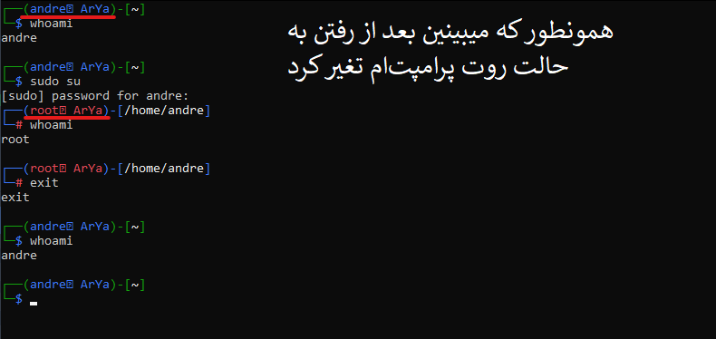

# sudo

کامند sudo که فکر میکنم مخفف superuser do باشه خیلی چیز مهمیه. حالا چرا مهمه؟؟

خب ببینین شما حتی اگه یه کاربر ویندوزی هم بوده باشید بالاخره تا امروز شده بخواین یه کاری بکنین و مثلا محبور شدین که برین سراغ cmd یا powersell (حالا اگر نمیدونین اینا چیه اصلا مهم نیس، نگران نباش =) ) بعدش میبینین که سیستم بهتون یه اخطاری میده و میگه شما یه کاربر غادی هستین و اجازه ی ایجاد هرتغیری توی سیستم رو ندارین. خب اینجاست که توصیه میشه اون cmd یا powersell رو با دسترسی ادمین یا به اصطلاح administrator privilege اجرا کنین. خب اصلا اینارو بیخیال بابا؛ وقتی که شما ادمین یه سیستم باشین خب خیلی منطقیه که هرکاری که میخواین بتونین باهاش بکنین دیگه. مثلا شما مالک خونتون هستین خب پس دلتون میخواد مبلمان رو اونجوری بپینین تلویزیون رو بزارین فلان جا و... ولی مثلا وقتی یه مهمان میاد خونتون که اجازه نداره که جای وسایل خونه ی شما رو تغیر بده که؛ بگذریم ...

خب خلاصش اینکه همه ی این سیستم عامل ها جوری تعریف شدن که هم کاربر اصلی داشته باشن و هم کاربر مهمان و خب اون کاربر اصلی عه که هرکاری که دلش بخواد میتونه با سیستم بکنه. توی لینوکس مرسومه که کاربر عادی میسازن (( یعنی توزیع هایی که اینستالر دارن اینجوری نصب میکنن یا پیشنهاد میکنن نصب کنین و توزیعای دیگم گفتم مرسومه اینگونه یوزری داشته باشیم )) و بعد اونو عضو گروه sudo میکنن درواقع (( whell group)) خب حالا این گروه جایی که دسترسی ادمین بخواد بهش داده میشه (( ما لینوکسیا میگیم تو حالت root قرار گرفته )) خب حالا کافیه ترمینالتو باز کنی و توش بنویسی sudo su که بعدش ازت پسوردتو میخواد ( پسورد میزنی تایپ میشه این که چیزی نشون نمیده نگرانش نباش <a href="https://emojikeyboard.org/copy/Face_with_Tears_of_Joy_Emoji_%F0%9F%98%82?utm_source=extlink">😂</a><a href="https://emojikeyboard.org/copy/Face_with_Tears_of_Joy_Emoji_%F0%9F%98%82?utm_source=extlink">😂</a>) (( درواقع این که حتی جای کاراکترهایی که برای پسورد وارد میکنی حتی ستاره یا دایره هم نمینویسه بخاطر اینه که اگر کسی کنارتون بود حتی طول پسوردتون رو هم نتونه بفهمه)) (((یعنی انقدر امنیت)))

خب حالا شما کاربر روت شدی هرکاری دلت بخواد میتونی بکنی دیگه. اگر هم میخوای ببینی چه کاربری هستی توی ترمینال بنویس whoami و اینتر بزن. اگرم خواستی از این مود کاربر روت بودن خارج بشی بنویس exit

ببینیم *_*

خب حالا پیشنهاد میشه تا لازم نشده روت نشین :))

خب پس کجا روت بشیم؟! هرجا که خواستیم یه کاری بکنیم و سیستم گفت اوووووی تو یه یوزر معمولی هستی. مثلا خواستیم یه چیزی نصب کنیم کخ جلوتر باهم یاد میگیریم

یه نکته دیگه اینکه لازم نیست هربار روت بشین تا یه دستوری رو اجرا کنین میتونین قبل اون دستور عبارت sudo رو بنویسین

مثلا اگر خواستی ls بگیری با دسترسی روت فقط کافیه بنویسی sudo ls حالا عر دستور دیگه ای هم مثل همین. لازم نیست مثلا اول بنویسی sudo su و بعدش بنویسی ls چون جفتشون یه طورن دیگه حالاااا

اهان یه نکته دیگم اینکه اون sudo su اون su اسم یوزر روتمونه اگر su خالی توی ترمینال بنویسین پسورد روت رو ازمون میخواد که نداریمش :))

پیچیده نشه بچه ها ببینین ما با دستور sudo با پسورد یوزر خودمون دسترسی روت میگیریم =). از لحاظ امنیتی ام مشکلی نداره چون ادمین سیستم به ما اعتماد کرده و این اچازه رو به ما داده. مثل اینکه شما مثلا به بچتون اعتماد میکنین و یه کلید از کلید قفل خونتون رو بهش میدین. خب دیگه بچتون که نمیاد از خونه ی شما دزدی کنه که ولی بهش توصیه میکنین که کلید رو گم نکن و... اینچا ام من به شما همین توصیه رو میکنم رمزتون رو تا میتونین نزد خود نگه دارین و جایی سوتی ندین که هک کردنتون دیگه خیلی کار سختی میشه

سرتونو درد نیارم امیدوارم سودو رو کامل فهمیده باشین =) اگرم نه خب سرچ کنین دیگه :)

