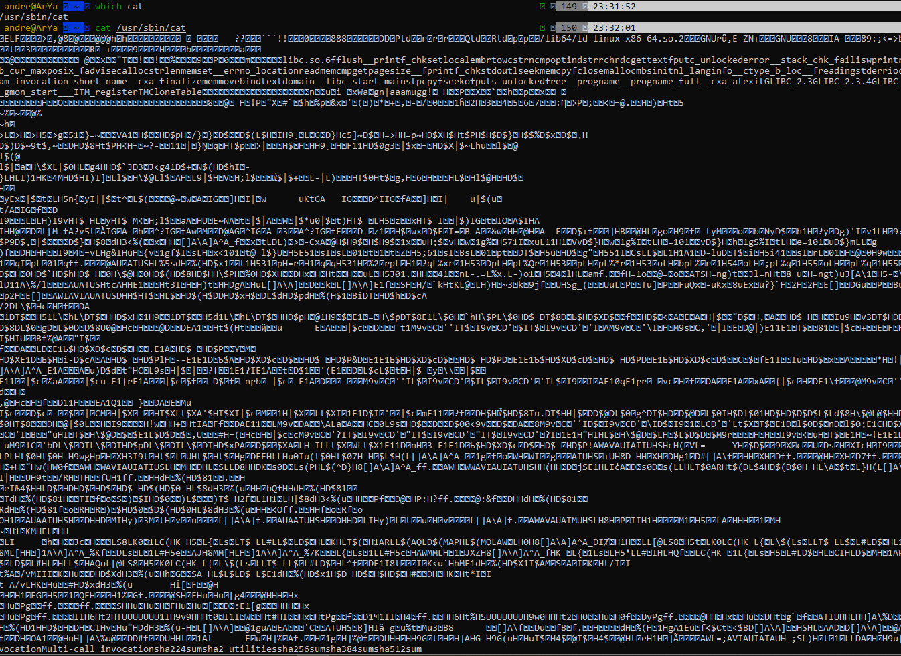

# which

خب این همه کامندی که توی ترمینال میزنین و اجرا میشن؛ یه جور برنامن دروافع. من بهشون میگم برنامه چون فایل اجرایی باینری دارن و یه کار مشخصی رو انجام میدن حالا نمیدونم چقدر تعریفم از کلمه‌ی "برنامه" درسته... :)

خب حالا اگه خواستی ببینی این کامندا فایلای اجراییشون کجاست توی ترمینالت بنویس which command-name به همین راحتی

پ‌ن: بالاتر به کلمه‌ی باینری اشاره کردم پس منطقا تویی دایرکتوری bin/ یا sbin/ باید باشن ولی خب به وفور دیده شده گاها توی usr/ هم بودن حالا اگه کنجکاوی درموردش که چرا و چگونه و برای چه اینجا یا اونجان سرچ کن و از منطق این مدل فایل سیستمای لینوکس مطلع شو و این حرفا :))

خب من تا امروز در همین حد ازش استفاده کردم و اصلا از آپشناش استفاده نکردم اگه دوست داشتین مثل همیشه منوالش رو بخونین که توصیه میکنم یه بار روزنامه وار بخونینش (حفظش لازم نیست بکنین همین که بدونین چه کارایی میتونه براتون بکنه بسته((نه این بلکه هرکامند دیگه ای)))

خب تا ایمجا ایم اینم بگم توی ترمینالت بنویس eccho $PATH حالا ابن دالر پس چیه رو جلوتر درمورد حرف میزنم ولی فعلا خروجی این کامند رو ببینین

یه سری مسیر که با " : " از هم جدا شدن خب یکی از این مسیرا همون مسیریه که کامند های شل ات توشونه که با کامند whivh همین الان چکش کردیم

داستان کلی از این قراره که این PATH یه متغیره که یه سری مسیر واسش تعین شده و هرکامندی که بخوای توی ترمینال اجرا بشه هم باید دسترسی execute داشته باشه و هم مسیرش توی این متغیر PATH باشه.

نکته 1: یادتون باشه قایلای باینری رو نمیشه خوند (حداقل من که بلد نیستم) خب اگه فایل اجرایی هرکدوم از کامندا رو cat کنین چیز جالبی نمیبینین دیگه :) خب پس خرابشون نکنین که درست کردنش دردسر داره :") ((حالا برای اینکه محتواش رو ببینی بنویس which bash ببین مسیرش کجاست و بعدش بنویس &#x3C;همون مسیری که ویچ نشونت داده بود> cat ((عکس نمونشو گذاشتم )) ((این کار ترسناکی نیس خیالت جمع))

نکته 2: تو درس بعدی در مورد پرمیشن ها (دسترسی ها) حرف میزنم و فعلا در همین حد بدونین و تا بلد نشدین به PATH تون رو به فاک ندین هرچند که اگه تو فایل خاصی نرین چیزی دستکاری نکنین، الان هربلایی سرش بیارین بعد از reboot شدن سیستم دوباره اوکی مبشه ولی خب کلا زیاد با این چیزا شوخی نکنین جلوتر کامند های اختصاصی خودمون رو هم میسازیم عجله نکنین =))

نکته مهم: این مسیرهایی که توی PATH اتون هستن قابل اطمینانن لذا هر فایل اجرایی رو تو این مسیرا قرار ندین یا نزارین قرار بدن (منظورم این به اصطلاح دوستان هکر عه) و اگه مسیری به PATH اضافه میکنین دیگه خودتون حواستون بهش باشه ( تا خودتون گاف ندین بقیه خیلی خیلی سخت میتونن به سیستم شما نفوذ کنن حالا اگه عمری باقی بود و حالی مانده بود در مورد استراتژی های ایمن سازی هم یه کوچولو ینی همونقدری که بلدم براتون مینویسم)

شاد و پیروز باشن

