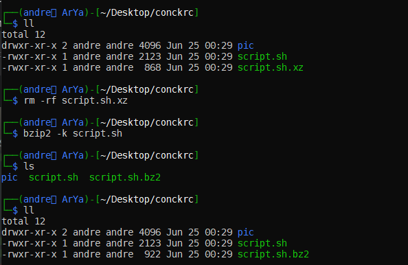

# zip , xz , gzip & bzip

خب سلام

امروز میخوایم یه فایلی رو فشرده کنیم که 4 تا کامند داریم که این کارو میکنن واسمون؛ سوال اول چرا 4 تا؟؟ خب این ربطی به لینوکس نداره 4 تا ابزارن که هرکدوم الگوریتم فشرده سازی و کارایی خودشونو دارن و ما صرفا باید بشناسیمشون و انتخاب کنیم که از کدومشون استفاده کنیم :) سوال دومم لابد اینه که واقعا لازمه هر 4تاشو بشناسیم؟؟! به نظرم آره چون ممکنه یکی یه فایل فشرده به شما بده که مثلا gzip باشه پس شما باید حداقل بشناسینشون به نظرم ...

خب اگه سوال دیگه‌ای هم دارین بی زحمت سرچ کنین به جوابش برسین؛ مرسی اه 😒😅

خب کامد اول zip

کار کردن باهاش خیلی راحته کافیه تو ترمینال بنویسی zip بعدش اسم فایل زیپت رو بنویسی که پسوندش zip. عه و بعد از اون هم اسم فایلی که قراره زیپ بشه دیگه (مثلا من میخام فایل alaki.txt را با اسم my-alaki-file.zip بیام و فشرده کنم 👇👇)

```
zip my-alalki-file.zip alaki.txt
```

خب این داداشمون خیلی آپشن داره و منم حقیقتا حفظ نیستم (منوالشو باز کن ببین) صرفا چنتاییش که الان تو خاطرمه رو بهتون میگم

با کامند unzip که اکسترکت میکنیم فایلو مثلا

```
unzip my-alalki-file.zip
```

با آپشن e- که مخفف encrypt (امیدوارم املاشو درست نوشته باشم) میای و رمز میزاری دیگه

با r- که مخفف recursive عه بازگشتی کار میکنه؛ خیلی بد توضیح دادم قبول دارم :) خلاصه بخام بگم واسه زیپ کردن یه دایرکتوری چون دایرکتوری یه محتوایی داره باید آپشن r- رو بزنی ((مثل پاک کردن یه دایرکتوری با دستور sudo که sudo -r میزدیم))

اگه یه فایل زیپ شده داری (مثلا اسمش my-zip-file.zip باشه) و میخوای محتواش رو ببینی کافیه بنویسی **zipinfo** my-zip-file.zip

یه آپشن d- داره که مثلا فکر کن ده تا فایل توی فایل زیپ شدت داری و میخوای مثلا سومی رو پاک کنی میزنی zip -d my-zip-file.zip file3

اگه اشتباه نکنم با u- میومد آپدیت میکرد مثلا فکر کن ده تا فایل با اسمای file1-10 داری بعد میخوای فایل11 رو هم اضافه کنی خب کافیه توی ترمنیال بزنی zip -u my-zip-file.zip file11 (حالا این به چ دردی میخوره خب واسه اضافه کردن یه فایل لازم نیس دوباره از اول زیپ کنی و تو وقتت صرفه جویی میشه دیگه...)

بقیشم یادم نیس والا یه v- یهویی یادم اومد که این تو 99% کامندای لینوکسی هست و به محفف verbose عه (هر غلطی که میکنه مینوسه روی ترمینال که آقا من دارم فلان غلطو میکنم ...)

خب xz هم هست اگه همون فایل alaki.txt رو بخواین با xz فشرده کنین باید بنویسین xz alaki.txt که این میاد فایلتون رو فشرده میکنه و تهش xz. میذاره که خب من اینو دوست ندارم چون فایل اصلی رو نداریم دیگه و فشرده شدشو داریم خب منطقا الان باید بگین اول با cp یه کپی ازش میگیرم و بعد فشردش میکنم که خب نه با این فرمت بزنی اوکی میشه ( اینم بگم که الگوریتم فشرده سازیش واقعا قوی عه )

```
xz -k alaki.txt
```

یا حتی میتونی با آپشن c- هم به فرم پایین اینکارو کنی که مزیت های دیگم داره (مثلا اسمشو خودت تعیین کنی)

```
xz -c alaki.txt > alaki.txt.xz 
```

یادت باشه اسم دومی حتما نباید مثل اولی باشه ها مثلا تو اصلا بزار ashghar (تو لینوکسم که پسوند مهم نیس پس فکر میکنم اون xz. رو هم نزاری اوکی عه ولی خب چه حیانتیه پسوند بزار که خودت بعدا بفهمی چه مدل فایلیه و با دیدنش بشناسیش دیگه😬😬)

برای اکسترکت کردنم از unxz استفاده میکنیم :))

کامندای بعدی gzip و bzip2 که من به شخصه gzip استفاده نمیکنم چون الگوریتمش انگار مثل zip عه (مطمئن نیستم اینطور فکر میکنم🤷‍♂️) دلایل خواص خودمم دارم (ایح ایح) :// بگذریم...

فرم استفادشم خیلی bzip2 طوره واسه همینمن ک مشکلی ندارم شمام خواستین بیشتر بدونین سرچ میکنین یا منوال میخونین دیگه :)

و اما bzip2 برای فشرده سازی لازمه بنویسی bzip2 alaki.text که خودش میاد فایل اصلی رو فشرده میکنه و تهش یه bz2. قرار میده که خب اگه خواستی فایل اثلی رو برات نگه دار میتونی با کامند k- اینکارو کنی (مثل همون xz) فلواقع آپشنا یه مدل طورن جالا من چنتاش که یادم باشه رو میگم

آپشن d- واسه دراوردن از فشرده سازیه که لازمه مثلا بزنی bzip -d alaki.txt.bz2 البته کامند bunzip2 هم کارش همینه مقایسه این پایین

 (1) (1).png>)

واسه gzip هم gunzip هست که اکسترکت کنه :))

آپشن v- که همون verbose عه ... لسیت بقیشم ایناها 👇👇

.png>)

فقط یه نکته بگم اون 9- ...1- چیه؟! ببینین اینا مثلا میاد هر تعداد بایتی رو کامپرس میکنه پس مثلا هرچی عدد بزرگتر یا به عبارتی به 9 نزدیک تر باشه فایلتون کم حجم تر میشه ولی از طرفی فشرده سازی و اکسترکت کردنش زمان بیشتری طول میکشه خب حالا بسته به نیازتون میتونین تعیین کنین تا چ حد فشرده بشه و اینا... (( خط بعدشم اون alias به معنی جایگزین عه ینی جای 1- میتونی بنویسی fast-- ))

پ‌ن : فک کنم بای دیفالت bzip2 روی 9 کامپرس میکرد...

یه مقایسه بین اینا بکنیم... من بخام رتبه بندی کنم به ترتیب میگم اول xz بعد bzip2 بعد zip و آخر gzip البته این نظر منه جلوتر یه لینک مقایسه تخصصی طور ترشونو میزارم (شمام میتونی نظر خودتو داشته باشی)

من یه فایل با محتوای تمام صفر و حجم 4 گیگ ساختم که فشردش کردم و خودتون نتیجه رو مقایسه کنین

.jpeg>)

اول از همه به تفاوت حجم فایل های فشرده شده نسبت به هم توجه کنین

خب ممکنه الان بگین خب حجم bzip2 که از همه کمتر بوده آره بخاطر محتوای فایله که الگوریتم bzip2 خیلی خوب عمل کرده ولی در عمل که ما یه فایل 4 گیگی که محتواش همش ضفر باشه که ندارم که آخه ://

لذا این مقایسه رم ببین



خب همینطور که میبینی xz بهتر عمل کرده خلاصه اینکه خواستی بدونی کدوم بهتره سرچ کن این لینک مقایسه خوبی کرده👇👇



خلاصش این :

xz takes a lot more time with its default compression level of 6 while bzip2 only takes a little longer than gzip at compression level 9 and compresses a fair amount better, while the difference between bzip2 and xz is less than the difference between bzip2 and gzip making bzip2 a good trade off for compression.

خب اینم از این من وقتی قراره تکلیفامو تحویل بدم با همون zip کارمو میکنم ولی وقته قراره یه چیزی واسه خودم آرشیو کنم از xz یا bzip2 استفاده میکنم (اینا یکم کند ترن که بخاطر همون بیشتر کامپرس کردنشونه)

یکم طولانی شد ببخشید دیگه 4 تا کامند بود :)

و مثل همیشه بیشتر خواستین بخونین و یادبگیرین سرچ کنین =))
